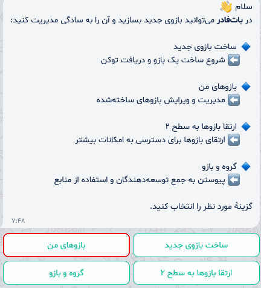
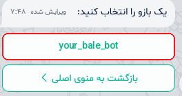
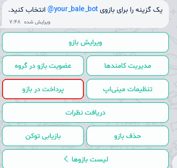
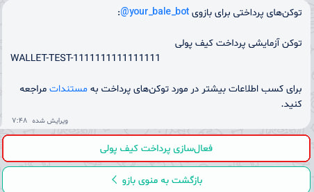
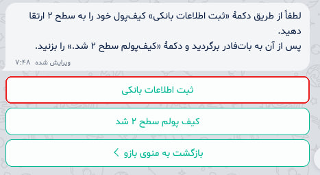
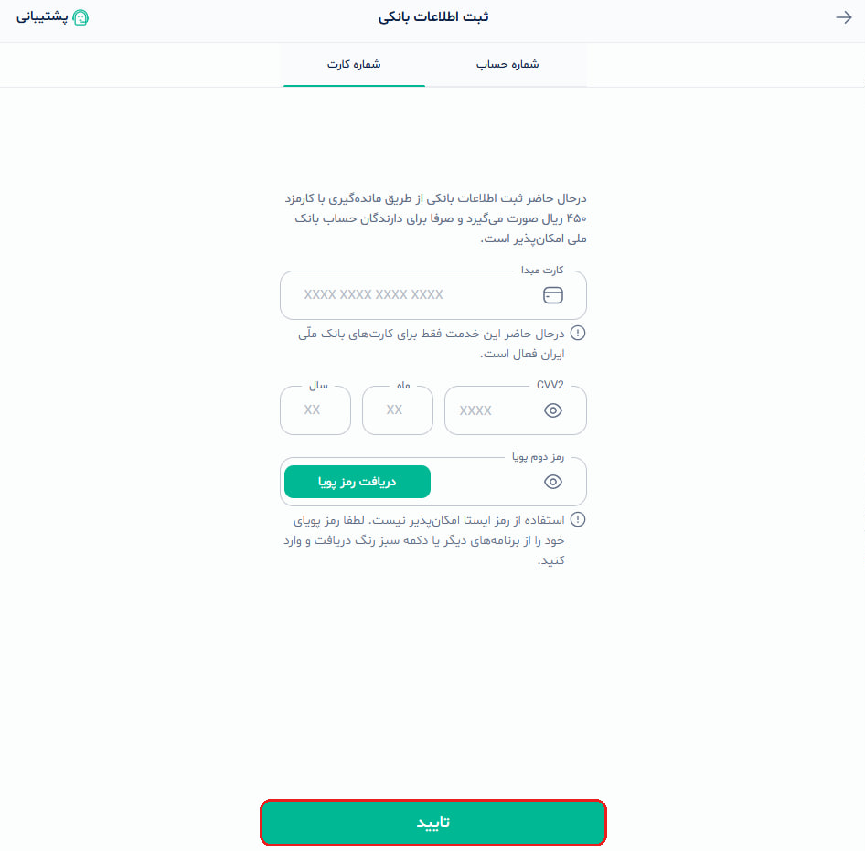

# راهنمای دریافت توکن کیف پول بله (Provider Token)

[🇬🇧 English Guide](wallet_provider_guide.md)

> [!IMPORTANT]
> ⚠️ 🏦 💳 **نکته:** در حال حاضر ارتقای کیف‌پول بله فقط با کارت و حساب **بانک ملّی ایران (BMI)** امکان‌پذیر است.

این راهنما مراحل دریافت توکن درگاه کیف پول بله (`PROVIDER_TOKEN`) از بات‌فادر را مرحله به مرحله توضیح می‌دهد.

---

## تفاوت حالت تست و واقعی

1. **حالت تستی (Sandbox):**
   اگر فعلاً حساب بانک ملی ندارید یا فقط می‌خواهید پروژه را تست کنید، نیازی به طی کردن مراحل زیر نیست. مستقیماً از توکن تست زیر در `settings.py` استفاده کنید:
   ```python
   "PROVIDER_TOKEN": "WALLET-TEST-1111111111111111"
   ```

2. **حالت عملیاتی (Live):**
   برای دریافت پول واقعی و واریز به حساب، باید مراحل زیر را انجام دهید تا توکن اختصاصی بات خود را دریافت کنید.

---

## مراحل دریافت توکن

*(در تمام تصاویر، دکمه‌های مورد نظر با کادر قرمز مشخص شده‌اند)*

### ۱. ورود به بات‌فادر
وارد [@BotFather](https://ble.ir/BotFather) شوید و دکمهٔ **«بازوهای من»** را بزنید.

<p align="center">
  
</p>

---

### ۲. انتخاب بات
از لیست، بات مورد نظرتان را انتخاب کنید.

<p align="center">
  
</p>

---

### ۳. ورود به بخش پرداخت
روی دکمهٔ **«پرداخت در بازو»** بزنید.

<p align="center">
  
</p>

---

### ۴. فعال‌سازی پرداخت کیف پولی
روی دکمهٔ **«فعال‌سازی پرداخت کیف پولی»** بزنید.  
*(اگر برای محیط دولوپمنت توکن تست می‌خواهید، همان توکن `WALLET-TEST-1111111111111111` در این پیام برایتان نمایش داده شده است).*

<p align="center">
  
</p>

---

### ۵. درخواست ارتقای کیف پول به سطح ۲
برای تسویه حساب بانکی، روی **«ثبت اطلاعات بانکی»** بزنید تا صفحه وب ثبت کارت باز شود.

<p align="center">
  
</p>

---

### ۶. ثبت اطلاعات کارت بانک ملی
اطلاعات کارت یا حساب بانک ملّی خود را وارد کرده و دکمهٔ **«تایید»** را بزنید.

<p align="center">
  
</p>

بعد از ثبت موفق:
1. برگردید به چت بات‌فادر (`@BotFather`).
2. دکمهٔ **«کیف‌پولم سطح ۲ شد.»** را بزنید.
3. بات‌فادر توکن درگاه عملیاتی شما را ارسال می‌کند.

---

### ۷. قرار دادن توکن در جنگو

توکن دریافتی را در فایل `.env` پروژه قرار دهید:

```bash
# .env
BALE_BOT_TOKEN="123456789:AA..."
BALE_PROVIDER_TOKEN="توکن-دریافتی-از-بات-فادر"
```

و در `settings.py` تنظیم کنید:

```python
import os

BALE_PAYMENTS = {
    "BOT_TOKEN": os.environ["BALE_BOT_TOKEN"],
    "PROVIDER_TOKEN": os.environ["BALE_PROVIDER_TOKEN"],
    "WEBHOOK_SECRET": os.environ.get("BALE_WEBHOOK_SECRET", "یک-رمز-تصادفی-طولانی"),
}
```

---

## نکات امنیتی

> [!WARNING]
> توکن‌های بات محرمانه هستند و به هیچ وجه نباید در گیت کامیت شوند.
> اگر احیاناً توکن لو رفت، سریعاً در `@BotFather` > بات مورد نظر > **بازیابی توکن** آن را باطل و مجدداً دریافت کنید.
